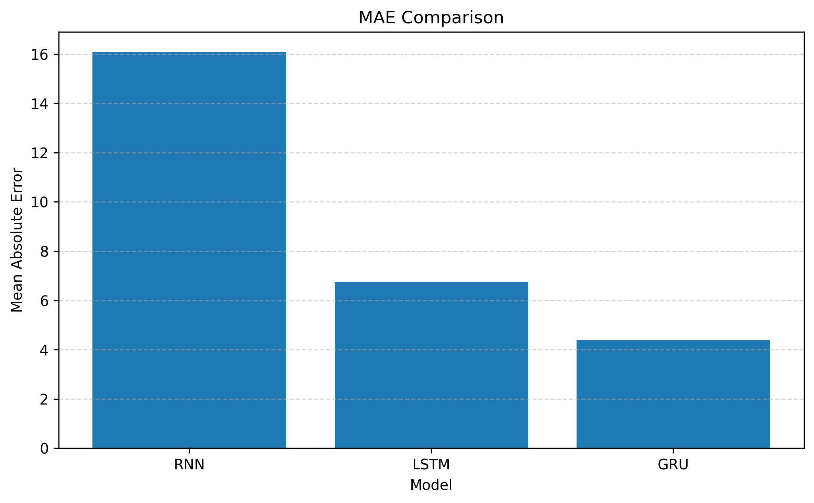
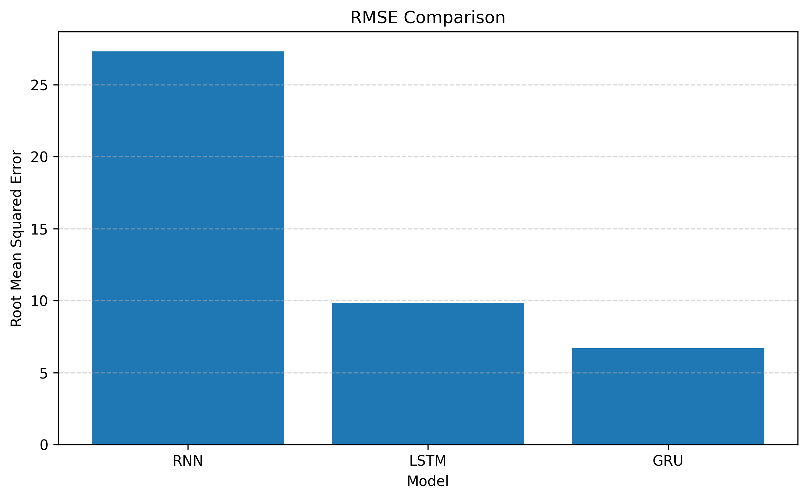
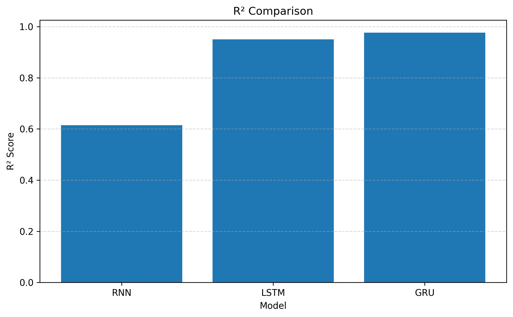

# Google Stock Price Prediction with Deep Recurrent Neural Networks

### A Comparative Study of Simple RNN, LSTM, and GRU Models for Financial Time-Series Forecasting

<p align="center">


</p>

---

## Project Overview

Forecasting stock prices is one of the most challenging applications of deep learning due to the dynamic and nonlinear nature of financial markets.

This project presents a comparative study of three recurrent neural network architectures—Simple RNN, Long Short-Term Memory (LSTM), and Gated Recurrent Unit (GRU)—for predicting Google's stock closing prices. Historical market data is collected from Yahoo Finance using the `yfinance` library and processed through a complete deep learning pipeline, including preprocessing, sequence generation, model training, evaluation, and comparative analysis.

The objective is to identify the most effective recurrent architecture for financial time-series forecasting by comparing predictive performance using multiple evaluation metrics.

---

## Key Features

- Historical Google stock data collection using Yahoo Finance
- End-to-end time-series preprocessing pipeline
- Data normalization with Min-Max Scaling
- Sliding window sequence generation
- Implementation of Simple RNN, LSTM, and GRU models
- Performance evaluation using MAE, RMSE, and R²
- Comparative analysis of deep learning architectures
- Visualization of model performance and evaluation metrics

---

## Technologies Used

| Category | Technology |
|----------|------------|
| Programming Language | Python |
| Deep Learning | TensorFlow / Keras |
| Data Processing | Pandas, NumPy |
| Machine Learning | Scikit-learn |
| Visualization | Matplotlib |
| Financial Data | yfinance |
| Development Environment | Jupyter Notebook |

---

## Repository Structure

```text
finance-prediction-rnn/
│
├── notebooks/
│   ├── 01_data_collection_preprocessing.ipynb
│   ├── 02_simple_rnn_model.ipynb
│   ├── 03_lstm_model.ipynb
│   ├── 04_gru_model.ipynb
│   ├── 05_model_evaluation.ipynb
│   └── 06_model_comparison.ipynb
│
├── results/
│   ├── mae_comparison.png
│   ├── rmse_comparison.png
│   ├── r2_comparison.png
│   ├── overall_model_comparison.png
│   └── model_comparison.csv
│
├── README.md
├── requirements.txt
└── LICENSE
```

---

## Dataset

Historical stock market data for **Alphabet Inc. (Google)** was retrieved directly from **Yahoo Finance** using the `yfinance` Python library.

| Item | Description |
|------|-------------|
| Company | Alphabet Inc. (Google) |
| Symbol | GOOG |
| Data Source | Yahoo Finance |
| Features | Open, High, Low, Close, Volume |
| Target Variable | Closing Price |

Before model training, the dataset was cleaned, normalized using Min-Max Scaling, transformed into sequential samples with a sliding window approach, and divided into training and testing sets.

---

## Project Workflow

```text
Data Collection
      ↓
Data Preprocessing
      ↓
Feature Scaling
      ↓
Sequence Generation
      ↓
Simple RNN
      ↓
LSTM
      ↓
GRU
      ↓
Model Evaluation
      ↓
Performance Comparison
```

---

## Deep Learning Models

### Simple RNN

A baseline recurrent neural network capable of learning temporal dependencies from sequential data.

### Long Short-Term Memory (LSTM)

An advanced recurrent architecture designed to capture long-term dependencies through memory cells and gating mechanisms.

### Gated Recurrent Unit (GRU)

A simplified yet highly efficient recurrent architecture that reduces computational complexity while maintaining excellent predictive performance.

All three models were implemented using TensorFlow/Keras and trained under identical experimental settings to ensure a fair comparison.

---

## Results & Performance Comparison

The predictive performance of the three architectures was evaluated using Mean Absolute Error (MAE), Root Mean Squared Error (RMSE), and the Coefficient of Determination (R²).

<p align="center">
  
  
  
</p>

### Performance Metrics

| Model | MAE ↓ | RMSE ↓ | R² ↑ |
|:------|------:|-------:|------:|
| Simple RNN | 16.0971 | 27.3194 | 0.6148 |
| LSTM | 6.7479 | 9.8324 | 0.9501 |
| **GRU** | **4.3902** | **6.7019** | **0.9768** |

### Key Findings

- GRU achieved the highest predictive accuracy.
- GRU produced the lowest MAE and RMSE values.
- GRU obtained the highest coefficient of determination (R² = 0.9768).
- LSTM also demonstrated excellent performance, significantly outperforming the Simple RNN model.

---

## Conclusion

This project demonstrates the effectiveness of recurrent neural networks for financial time-series forecasting through a comprehensive comparison of Simple RNN, LSTM, and GRU architectures.

Among the evaluated models, **GRU achieved the best overall performance**, delivering the lowest prediction errors and the highest coefficient of determination. These results indicate that GRU provides an excellent balance between predictive accuracy and computational efficiency for Google stock price forecasting.

---

## Future Improvements

- Hyperparameter optimization
- Transformer-based forecasting models
- Attention mechanisms
- Multivariate stock prediction
- Real-time prediction pipeline
- Model deployment using Streamlit or FastAPI

---

## Installation

```bash
git clone https://github.com/kosar-am/finance-prediction-rnn.git

cd finance-prediction-rnn

pip install -r requirements.txt
```

---

## How to Run

Execute the notebooks sequentially:

```text
01_data_collection_preprocessing.ipynb
02_simple_rnn_model.ipynb
03_lstm_model.ipynb
04_gru_model.ipynb
05_model_evaluation.ipynb
06_model_comparison.ipynb
```

---

## License

This project is released under the MIT License.
